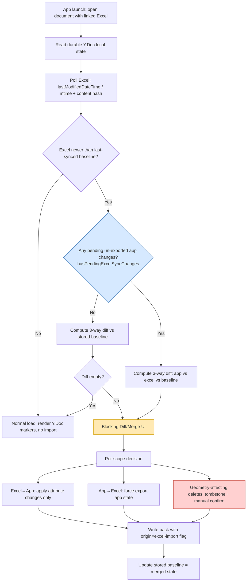

# Excel ↔ PDF Survey-Marker Sync — Authoritative Map

> **Audience:** product owner (plain narrative) + engineer (file:line precision).
> **Terminology:** Survey Markers are placed checklist markers on PDF pages, backed by a linked Excel sheet over Microsoft Graph. Always written in full.
> **Sourcing rule applied:** where Gemini's general claims conflicted with the code findings, the code wins. Those corrections are called out inline.
> **Produced:** 2026-06-07 via the `excel-sync-deep-map` workflow (4 parallel investigators + synthesis). Inputs: live code trace, the template-merge precedent, external research (Microsoft Graph / Bluebeam / AutoCAD / ArcGIS), and Gemini's "Refining Excel-PDF Sync Logic" chat.

---

## 1. How it works today

### App startup (opening a document with a linked Excel sheet)

When you open a document whose template has a linked Excel path, the app **silently** pulls from Excel. There is no prompt, no preview, no "Excel changed — review?" step.

- An effect fires on template change (`PDFViewer.jsx:12729–12734`) and calls `loadLatestSurveyData()`.
- The app compares two timestamps (`PDFViewer.jsx:12677–12727`):
  - **App side:** `selectedTemplate.updatedAt` (or `lastSyncTime`, or `0`). Critically, `updatedAt` changes on *any* template config edit — not only on an Excel export — so it is a weak, misleading anchor.
  - **Excel side:** OneDrive `lastModifiedDateTime` (via `getFileById`) or local file `stats.mtime`.
- If `excelTimestamp > supabaseTimestamp` (`PDFViewer.jsx:12713`), it waits **500 ms** (`setTimeout`, `PDFViewer.jsx:12718–12722`) then calls `handleSyncFromExcel()` — with no user interaction.

The only times the user ever sees a dialog on the inbound path:
1. **Schema change** → `NewColumnsModal` (columns added/removed/reordered in Excel).
2. **Total wipe of a category** → a single `window.confirm` that fires *only* if 100% of the Survey Markers in a category-scope would be deleted.

Everything else happens silently.

### Adding a Survey Marker in the app

- The draw path calls `setSurveyMarkers(...)` to store the new marker (`PDFViewer.jsx:30895`), with real geometry (`pageNumber`, `bounds`).
- **No automatic Excel write.** The dirty-fingerprint effect (`PDFViewer.jsx:9470–9484`) flips `hasPendingExcelSyncChanges = true`, but nothing pushes.
- The marker only reaches Excel on the next **manual save** (`handleSaveDocument`, non-silent) — and only then if `excelSyncPreference === 'always'` (auto-push) or the user accepts the `ExcelSyncConfirmModal`.
- **Auto-save does NOT push to Excel.** Auto-save calls `handleSaveDocument(true)` with `silent=true`, and the Excel-sync gate requires `!silent` (`PDFViewer.jsx:17401–17437`). So a 30-second auto-save persists the app state but never exports the new row.

> **Correction to Gemini:** Gemini implied writes happen "when unlocked." In reality the app→Excel write is **deferred and asymmetric** — add and answer-change wait for an explicit non-silent save; delete pushes immediately (below).

### Deleting a Survey Marker in the app

- This is the **one** immediate outbound write. After `setSurveyMarkers` removes the marker, `pendingExcelSyncAfterDeleteRef.current = true` is set (`PDFViewer.jsx:22466–22471`), and the very next `surveyMarkers` change triggers `pushToExcelWithRetry()` (`PDFViewer.jsx:22631–22636`).
- The entire workbook is rebuilt and re-uploaded; the deleted row is gone from Excel within seconds, **no prompt**.

### Changing an answer (checklistResponses)

- `setSurveyMarkers` updates in-app state (e.g. `PDFViewer.jsx:15151, 15182, 15211`), flips the dirty flag, and waits for a manual non-silent save — same deferred path as add.

### Adding a row in Excel

- On next import, the row matches no in-app marker (match is by **name string** within `moduleId+categoryId`, `PDFViewer.jsx:13107–13115`).
- A new **data-only** Survey Marker is created with `pageNumber: null, bounds: null` (`PDFViewer.jsx:13224–13239`). It appears in the survey panel but has **no placement on the PDF** until the user drags it onto a page.

### Deleting a row in Excel

- The matching in-app marker's name is now absent from the import → it goes into `surveyMarkersToDelete` (`PDFViewer.jsx:13247–13259`).
- A single missing row in a populated category is **deleted silently** (no prompt). Only a 100%-of-scope wipe triggers `window.confirm` (`PDFViewer.jsx:13285–13303`).
- The placed marker — with its canvas geometry — is removed, and `annotationsByPage` is cleared for it (`PDFViewer.jsx:13306–13382`). **Geometry is permanently lost.**

### Renaming a row in Excel

- Because the match key is the name string, a rename reads as **delete-old + add-new**:
  - The old name matches nothing in Excel → old marker classified for deletion → **placed marker with geometry is silently destroyed.**
  - The new name matches no in-app marker → a new unplaced shell (`bounds: null, pageNumber: null`) is created.
- Net: rename in Excel **silently loses the marker's position on the PDF.**

### Moving a row in Excel (reorder)

- Reorder is safe. `excelRowIndex` is re-read from the row's new position (`PDFViewer.jsx:13124–13125`); `pageNumber`/`bounds` are preserved. The marker survives as long as the **name string is unchanged**.

> **Correction to Gemini:** Gemini said move/rename should be "last-write-wins per-marker UTC timestamp." Today there is **no timestamp tie-break and no stable ID** — matching is pure case-sensitive name equality, so rename is destructive, not LWW.

### ⚠️ THE CURRENT BUG — a marker added in the app silently vanishes on reload, and the durable store is now corrupted too

This is the headline failure, and it is now worse than a UI glitch.

**The vanishing:**
1. User adds a Survey Marker in the app. It is *not* auto-pushed to Excel (add is deferred; auto-save is silent and skips Excel).
2. The app's template `updatedAt` is a generic field; the Excel file's `lastModifiedDateTime` can easily be newer (any prior Excel touch).
3. On the next open, the startup timestamp check sees `excelTimestamp > supabaseTimestamp` and **silently imports** (`PDFViewer.jsx:12713–12722`).
4. The import matches by name. The newly-added marker is **not in the sheet**, so it is classified as "deleted in Excel" and removed (`PDFViewer.jsx:13247–13259`). A single missing marker → **no confirm.**
5. The marker disappears. The user never exported it, never deleted it — it's just gone.

**The new, deeper damage — durable-store corruption:**
- After `executeExcelImport` calls `setSurveyMarkers(newSurveyMarkers)` (`PDFViewer.jsx:13452`), React re-renders.
- The capture effect in `useAnnotationDoc.js:168–172` fires on **every** `surveyMarkers` change, unconditionally, and calls `h.applySurveyMarkers(surveyMarkers)`.
- That runs `syncSurveyMarkersToDoc` (`src/services/annotationDocStore.js:92–123`), which **deletes any Y.Map key absent from the new dict** (`annotationDocStore.js:103–105`).
- So the false-positive deletion is now written into the **durable Y.Doc** — the authoritative store.
- **There is no `origin` flag distinguishing an Excel-import write from a real user edit.** The capture effect treats them identically.

**Consequence:** even if the user later *detaches* Excel, the marker is gone for good — the Y.Doc no longer has it. The bug used to be "Excel can ghost an unsaved add"; it is now "Excel can permanently corrupt the durable annotation store." This is the single most important thing to fix.

---

## 2. What Excel can and cannot represent

A linked Excel sheet is a **flat grid of rows and columns**. Each Survey Marker is one row; each checklist question is one column. That structure can carry *attributes* but cannot carry *space*.

**Excel CAN represent (and does round-trip):**
- `name` (the row identity / match key)
- `checklistResponses` (one column per checklist item: Y / N / N/A + note text)
- `entityName` / `entityColor`, free-text `note.text`
- `changedDate` (audit column)
- `excelRowIndex` (row order only)

**Excel CANNOT represent (app-only, never in a column):**
- `pageNumber` — which PDF page the marker sits on
- `bounds` — the x/y/width/height rectangle on that page
- the canvas annotation (`annotationsByPage` entry, the Fabric.js rect, `annotationId` linkage)
- visual properties beyond entity color (opacity, stroke weight)
- undo/history membership

This is why every Excel-created marker is born with `pageNumber: null, bounds: null` (`PDFViewer.jsx:13236–13237`) — a "ghost" row with no body on the PDF.

**The implication — a hard architectural rule confirmed by the whole industry:** a flat sheet has no vocabulary for *placement*. Every mature spatial tool enforces the same boundary:
- **ArcGIS:** Excel/CSV can edit attributes; spatial geometry is owned exclusively by the geodatabase. "When your feature layer contains location data, you cannot change the Location type field."
- **Bluebeam:** markup geometry lives in the PDF annotation layer; only *measurement values* flow to Excel — and only one way (Revu → Excel).
- **AutoCAD/Civil 3D:** the data link controls cell values; placement (which drawing, which coordinates) is AutoCAD-owned and never round-trips through Excel.

**Therefore:** Excel should be allowed to *modify attributes of existing, app-created* Survey Markers. It should **never** be the authority that *creates a placed marker* (it can't supply geometry) or *destroys a placed marker* (it can't tell "user deleted this" apart from "user filtered/sorted the view"). Creation and destruction of spatially-placed markers must originate from the app.

---

## 3. The full lifecycle, mapped

### 3a. Startup decision flow (target design, with the safety gate today's code lacks)



> The red node (geometry-affecting deletes) and the blue node (pending-changes guard) are exactly what today's silent path skips. The `origin=excel-import` flag (orange path → O) is the missing guard that would stop §1's durable-store corruption.

### 3b. Concurrent two-user case (one editing in Excel, one in the app)

```mermaid
sequenceDiagram
    participant XL as User A (desktop Excel, file open)
    participant Cloud as OneDrive/SharePoint workbook
    participant App as User B (PDF app)
    participant YDoc as Durable Y.Doc

    Note over XL,Cloud: A opens workbook in desktop Excel → shared/exclusive lock active
    App->>YDoc: B adds a Survey Marker (geometry set)
    App->>Cloud: B triggers export (PUT /content)
    Cloud-->>App: 423 Locked (A holds the lock)
    Note over App: No proactive lock API exists.<br/>Lock only discoverable by attempting the write.
    App->>App: Today: inbound path ignores locks;<br/>outbound shows ExcelLockedModal (Cancel / Try Again)
    App->>App: Recommended: queue to pending buffer,<br/>retry with exponential backoff

    Note over XL: A edits a cell, saves → Cloud lastModifiedDateTime bumps
    App->>Cloud: B reopens → poll sees Excel newer
    App->>App: 3-way diff (app vs excel vs baseline)
    alt Both changed the SAME marker field
        App->>App: Genuine conflict → surface diff UI
    else Only one side diverged from baseline
        App->>YDoc: Apply that side automatically
    end
```

**The hard truth this diagram encodes:** you **cannot** write to a workbook a user has open with a lock, and there is **no API to know it's locked in advance** — you can only attempt the write and catch `423 Locked` (or `412 Precondition Failed` with an `If-Match` etag). Teams-style live co-authoring is impossible for a third-party app via Graph; Graph is not a co-author, it's a separate locking layer.

---

## 4. Mutation matrix

Risk reflects real constraints: file locking (can't write to an open workbook; no proactive lock API), and the flat sheet's inability to carry geometry.

| Action | Source | What happens **today** (code-grounded) | Risk | Recommended resolution |
|---|---|---|---|---|
| **Create** | **App** | `setSurveyMarkers` stores marker with geometry (`30895`). No auto-push; reaches Excel only on non-silent save (`17401–17415`). Auto-save skips Excel. | **High** if Excel is the authority on next open — unsaved add gets ghosted (see §1 bug). | Queue to outbound buffer; flush on next successful (unlocked) export. Never let a later import delete an app-created marker that hasn't been confirmed-exported. |
| **Create** | **Excel** | New row → data-only marker, `pageNumber/bounds: null` (`13224–13239`). Appears in panel, unplaced. | **Low** | Keep. Surface as "needs placement" (orange search/locate button). Excel may *introduce* a row but never supplies geometry — user places it. |
| **Delete** | **App** | Immediate `pushToExcelWithRetry()` (`22466–22471`, `22631–22636`); whole workbook re-uploaded. | **Medium–High** if workbook locked: today the outbound retry shows `ExcelLockedModal`. | Soft-delete: mark row `status=Deleted` (hidden `_isDeleted` column) to avoid index shift; flush on unlock. |
| **Delete** | **Excel** | Matching marker → `surveyMarkersToDelete`; single deletion silent, only 100%-of-scope triggers `window.confirm` (`13247–13303`). Geometry destroyed; Y.Doc key removed (`annotationDocStore.js:103–105`). | **Critical** — indistinguishable from a filter/sort; silently destroys placement and corrupts durable store. | **Never auto-delete.** Flag `_pendingDeletion`, require explicit in-app confirm before removing from canvas. Industry-universal rule. |
| **Rename** | **Excel** | Name is the match key → reads as delete-old + add-new. Placed marker silently destroyed; unplaced shell created (`13107–13115`, `13224–13239`). | **Critical** — silent geometry loss. | Stop matching by name. Add a stable hidden ID column; treat name as an editable attribute, not identity. |
| **Rename** | **App** | Updates `name` in state; reaches Excel on non-silent save. | **Low** | Keep; with a stable ID, name becomes pure attribute → LWW per field is safe. |
| **Move / reorder** | **Excel** | `excelRowIndex` re-read; geometry preserved (`13124–13125`). | **Low** | Keep. Reorder affects panel sort only, not PDF placement. |
| **Move (reposition on PDF)** | **App** | Geometry change in state; deferred to non-silent save. | **Low** | Keep; geometry is app-owned and never round-trips through Excel. |
| **Answer-change** | **App** | `setSurveyMarkers` (`15151/15182/15211`), deferred to non-silent save. | **Low** | Keep; the safe, intended round-trip direction. |
| **Answer-change** | **Excel** | Matched by name → `checklistResponses` updated in place (`13107–13115`). | **Low–Medium** | Safe attribute sync. Add per-field 3-way merge to catch concurrent edits to the same answer (see §5). |

---

## 5. How professional apps avoid collisions

### Corrected Microsoft Graph + Excel locking facts (code-relevant)

- **No proactive lock API exists.** You cannot ask Graph "is this file open?" You discover a lock only by attempting a write and catching **`423 Locked`** (or **`412 Precondition Failed`** with an `If-Match` etag). A `lockState` endpoint has been publicly requested but does not exist as of 2026.
- **Concurrent Graph writes are discouraged by Microsoft itself:** "concurrent write requests… are often the cause of throttling, timeout… merge conflict… and other types of failures."
- **Local vs cloud is a hard fork in strategy.** For a **local** `.xlsx`, Graph cannot touch it at all — use the OS filesystem and catch the sharing-violation on exclusive open. For a **cloud** workbook, Graph can write and will surface `423` — retry with exponential backoff.
- **Graph is not a co-author.** Teams-style real-time co-authoring is supported only for listed Excel clients (Excel desktop/web/mobile). A third-party Graph writer is a separate locking layer, not a participant.

> **Correction to Gemini:** Gemini proposed "poll last-modified + hash to know when it's safe to write." That tells you the file *changed*; it does **not** tell you a write will *succeed*. The correct model is **attempt-and-catch-423 + backoff** (cloud), or **exclusive-open-and-catch-sharing-violation** (local).

### The three canonical patterns (verified, with fit)

1. **Spreadsheet-as-source-of-truth, one-way import** (AutoCAD data links, ArcGIS CSV import, Bluebeam export). App reads on open/poll; writes never auto-flow back. Zero collision risk; simplest. *Cost:* app and sheet diverge unless the user re-imports.
2. **Check-in / check-out exclusive lock** (SharePoint, Autodesk Vault, SolidWorks PDM). Lock before edit; others read-only. Prevents collisions by construction. *Cost:* serializes everyone — terrible for high-frequency or concurrent work.
3. **Hidden DB middleware** (Stacksync, GISconnector, PowerSync). Neither side talks directly; both sync to a canonical DB (usually Postgres/Supabase, **not** SQLite — Gemini's specific claim). Conflicts resolved in the DB layer; sidesteps file locking entirely. *Cost:* requires an Excel add-in on every machine + cloud DB infra.

### Conflict resolution the mature products actually use

- **Row-level last-write-wins** for attributes (ArcGIS feature services) — minimum viable.
- **3-way merge against a stored baseline** for anything where silent overwrite hurts (PowerSync custom hooks, Cosmos DB, ArcGIS geodatabase versioning). LWW alone silently discards the "loser's" edit when both sides change the same field between syncs; a baseline anchor turns LWW into a real 3-way merge **without** CRDT complexity.
- **Soft-delete tombstones** are standard everywhere (Airtable, PowerSync, Whalesync).
- **The spatial boundary is universal:** Excel edits attributes of existing app-owned objects; it never creates or destroys spatially-placed objects.

**Which pattern fits this app.** Survey Markers are low-frequency edits with app-owned geometry and a real Teams-style collaboration goal. Pure one-way import (Pattern 1) throws away the answers-back-from-Excel workflow the user wants. Check-out locking (Pattern 2) kills collaboration. Full hidden-DB middleware (Pattern 3) is the gold standard but is heavy (add-in + infra) — and the app *already* has a canonical store (the Y.Doc + Supabase). So the right shape is a **hybrid**: treat Excel as an **asynchronous attribute database** layered on top of the app's existing canonical store, with a 3-way baseline, tombstones, and a hard spatial boundary — not a live canvas.

---

## 6. Design options for THIS app

### Option A — "Answers-only": Excel can change attributes, never place or remove a marker

**Startup:** poll Excel; if newer, import **attribute fields only** (`checklistResponses`, `entityName/Color`, `note.text`, `name` as attribute). Never create a marker from an unmatched row; never delete a marker from a missing row.

**Per mutation:**
- *Create in Excel:* unmatched row → shown in a "from Excel — not yet placed" tray (informational), but it is **not** a marker until the user explicitly converts + places it. No `bounds: null` ghosts polluting the canvas list.
- *Delete in Excel:* missing row → **ignored** for deletion. (Optionally surfaced as "this row no longer in Excel — keep or remove?")
- *Rename in Excel:* with a stable hidden ID, the row still matches → name updates as an attribute, geometry untouched.
- *Create/delete/move in App:* fully app-owned; export pushes attributes out.

**Protects:** geometry, absolutely. The §1 bug becomes **impossible** — Excel can never trigger a marker deletion, so no ghosting and no durable-store corruption.
**Costs:** requires the stable-ID column and ripping out name-based deletion. Loses the ability to bulk-delete markers from Excel.
**Gives up:** "manage the whole marker set from the sheet." Excel becomes a data-entry surface, not a roster.
**Worst case:** user deletes 50 rows in Excel expecting the markers to clear — nothing clears; they must delete in-app. (Mitigation: a non-destructive "Excel dropped these N rows — review" panel.)

### Option B — Startup 3-way diff/merge prompt (reuse the template precedent) + soft-delete tombstones

**Startup:** poll Excel; if newer (or if there are pending app changes), compute a **3-way diff** — app state vs Excel vs a **stored baseline snapshot** (the missing piece today; baseline currently lives only in a ref and is lost on reload). If the diff is non-empty, show a **blocking merge modal** modeled on `NewColumnsModal` (the proven pause-detect-present-decide flow) — but row-level instead of column-level, keyed by `moduleId+categoryId`.

**Per mutation:**
- *Create in Excel:* listed under "New from Excel (will be unplaced)" — user accepts → ghost marker created, flagged "needs placement."
- *Delete in Excel:* listed under "Removed in Excel" → **never auto-applied.** User must tick it; geometry-bearing markers get an extra confirm. Internally a **tombstone** (`_isDeleted`, hidden column) rather than a hard delete, to avoid row-index shift.
- *Rename in Excel:* with stable ID → shown as "renamed" (attribute), not delete+add.
- *Conflict (both sides changed same field):* shown side-by-side, user picks; one-sided divergence from baseline auto-applies.

**Protects:** everything — nothing destructive happens without explicit review; baseline kills silent overwrite; tombstones make deletes reversible.
**Costs:** the most UI work (row-level merge modal), plus a **persisted baseline** (Supabase column or annotation-store entry) and a hidden `_isDeleted` column in the sheet.
**Gives up:** silent zero-friction sync — every divergent open shows a dialog (acceptable; matches the user's "show me the discrepancies" Teams instinct).
**Worst case:** users habituate and "accept all" through a destructive delete. (Mitigation: default deletes to *unchecked*; require a second confirm for geometry-bearing removals.)

### Option C — Excel-as-source-of-truth with an explicit import wizard

**Startup:** **no** auto-import. A banner: "Excel changed — Review import." Clicking opens a wizard (rows added / changed / removed) and the user runs the import deliberately.

**Per mutation:**
- *Create in Excel:* wizard adds ghost markers (unplaced).
- *Delete in Excel:* wizard proposes deletions; user confirms per scope; still tombstoned, not hard-deleted.
- *App side:* app edits are treated as provisional until reconciled with the sheet on the next import.

**Protects:** removes all *silent* behavior (kills the §1 bug by killing the silent trigger). Matches the AutoCAD/Bluebeam pro pattern.
**Costs:** moderate (wizard UI). Conceptually demotes the app — Excel "wins," which clashes with app-owned geometry.
**Gives up:** real-time feel entirely; nothing syncs until the user runs the wizard.
**Worst case:** two users diverge for days; the eventual import is a giant, error-prone reconciliation.

### Option D — Hybrid: asynchronous attribute-DB with locked-file buffer (recommended shape)

**Startup:** like B (3-way diff vs persisted baseline, blocking merge only when there's a real divergence), **but** with Option A's hard spatial boundary baked in: Excel rows can only ever change attributes or *propose* (never auto-apply) placement/removal.

**Per mutation:**
- *Create in App:* geometry-bearing marker; **queued to an outbound buffer** (`pending_excel_sync`) and flushed on the next successful, unlocked export. An add can **never** be ghosted by a later import because it's tracked as pending-unexported.
- *Delete in App:* soft-delete (`status=Deleted`, hidden column) to dodge index shift; flush on unlock.
- *Create in Excel:* ghost marker, "needs placement."
- *Delete/rename in Excel:* tombstone + explicit confirm; stable-ID matching so rename is an attribute.
- *Locked workbook:* on `423`, write to the buffer and retry with exponential backoff — never lose the write, never block the user.
- *Durable store:* every import write carries `origin='excel-import'` so the capture effect (`useAnnotationDoc.js:168–172`) can refuse to let an import delete a marker the user added but hasn't exported — **directly closing the §1 corruption.**

**Protects:** geometry, unsaved adds, locked-file writes, and the durable Y.Doc — the full failure set.
**Costs:** the union of A+B engineering: stable ID, persisted baseline, tombstone column, outbound buffer, `origin` flag in the capture effect.
**Gives up:** simplicity. This is the most code.
**Worst case:** buffer never flushes because the workbook stays locked for days — but the user still sees their markers locally and a clear "N changes pending export (file open elsewhere)" indicator; nothing is lost.

---

## 7. Recommendation

**Adopt Option D (the hybrid), staged — and ship the safety floor first.**

The user's goal is Teams-style collaboration. The corrected Microsoft Graph reality says true live co-authoring through a third-party app is **impossible**: you cannot write to a locked-open workbook and there is no API to know it's locked except by trying. So the honest framing is: **Excel is an asynchronous attribute database, not a live shared canvas.** Option D delivers the *feel* of collaboration (changes flow both ways, conflicts are surfaced, nothing is lost) within that hard limit, while A/B/C each give up something the user actually wants (A loses Excel-driven roster management, C loses real-time feel, B alone doesn't solve locked-file writes).

**Stage it so value lands before the big build:**

1. **Safety floor (do immediately — this is a data-loss bug, not a feature):**
   - Add `origin='excel-import'` to import-driven `setSurveyMarkers`/`applySurveyMarkers` writes and make the capture effect (`useAnnotationDoc.js:168–172`) refuse to delete Y.Doc keys for markers that are **app-created and not yet exported**. Kills the durable-store corruption in §1.
   - Gate the silent startup import on `hasPendingExcelSyncChanges` — never silently import over un-exported local adds.
   - Change Excel-side deletion from "silent unless 100% of scope" to **"never auto-delete; flag for confirm."**
2. **Stable identity:** add a hidden ID column; stop matching markers by name string. This alone converts rename from destructive to safe.
3. **Persisted baseline + tombstones:** store the last-synced snapshot durably (today it's an in-memory ref lost on reload, which makes `hasPendingExcelSyncChanges` falsely true after every reload) and add `_isDeleted` soft-delete.
4. **3-way merge modal:** reuse the `NewColumnsModal` chrome, row-level, keyed by `moduleId+categoryId`.
5. **Locked-file buffer + backoff:** outbound buffer flushed on unlock; `423`/`412` handled with exponential backoff on the cloud path, exclusive-open-and-catch on the local path.

**Decisions that still need the user** (these change the build, see §8): local vs OneDrive as the primary workflow; whether Excel may ever *introduce* a new marker at all; and how aggressively to surface conflicts (every divergence vs only same-field collisions).

---

## 8. Open questions for the user

1. **Is the Excel file usually local, or on OneDrive/SharePoint?** This forks the entire write strategy. Local → no Graph at all; the app must catch an OS sharing-violation on exclusive open and buffer. Cloud → Graph writes that hit `423 Locked` need retry/backoff. If both are in play, we build and test both paths. *Consequence of guessing wrong: the locked-file handling silently does nothing on the path we didn't build for.*

2. **Should Excel ever be allowed to introduce a brand-new Survey Marker?** If a colleague types a new row in the sheet, do you want it to appear in the app as an unplaced "needs placement" item (convenient, but pollutes the list with ghosts) — or should new markers *only* ever be born in the app, and Excel rows with no matching marker be flagged as errors? *Consequence: "yes" means living with unplaced ghosts; "no" means the sheet can't be used to seed a survey.*

3. **When a row disappears from Excel, what did the user most likely mean?** A deleted row is genuinely ambiguous — intentional removal vs. a filter/sort/accidental cut. Do you want *every* missing row to require an in-app confirm before the marker is removed (safe, but a confirm storm if someone sorts the sheet) — or a tombstone that hides the marker but keeps it recoverable for N days? *Consequence: confirm-always protects against accidental sorts but nags; tombstone-only is quieter but markers "disappear" until someone checks the trash.*

4. **When two people change the same answer on the same marker between syncs, who wins?** Silent last-write-wins (simplest, but the loser never knows their answer was discarded) — or always surface a side-by-side "App says Y, Excel says N — choose" for same-field collisions? *Consequence: LWW is invisible and occasionally wrong; surfacing every collision is safe but adds friction exactly when two people are actively collaborating.*

5. **How "live" do you actually need this to feel?** Given that we *cannot* write to a workbook someone has open, are you OK with "changes reconcile when the file is free, with a clear 'N pending, file open elsewhere' indicator" (honest, lossless, not instant) — or is near-real-time so important that we should consider the heavier hidden-DB-middleware path (an Excel add-in + cloud DB) that sidesteps file locking entirely? *Consequence: the buffer approach is weeks of work and occasionally delayed; the middleware approach is months and requires installing an add-in on every machine, but is the only way to get true low-latency two-way sync.*
