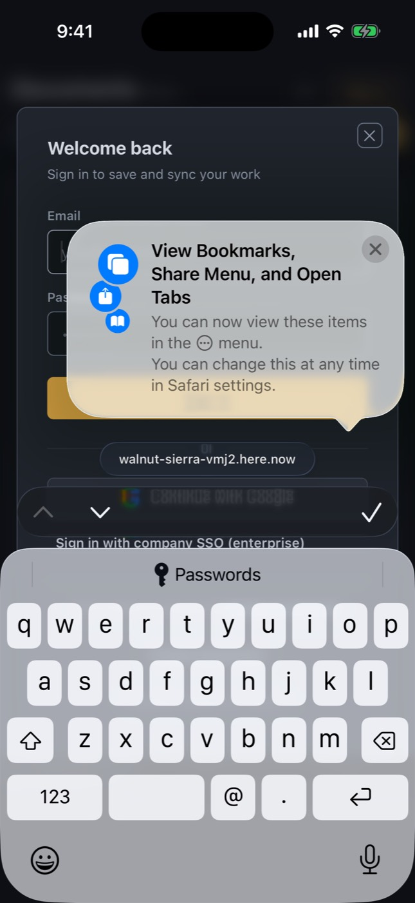
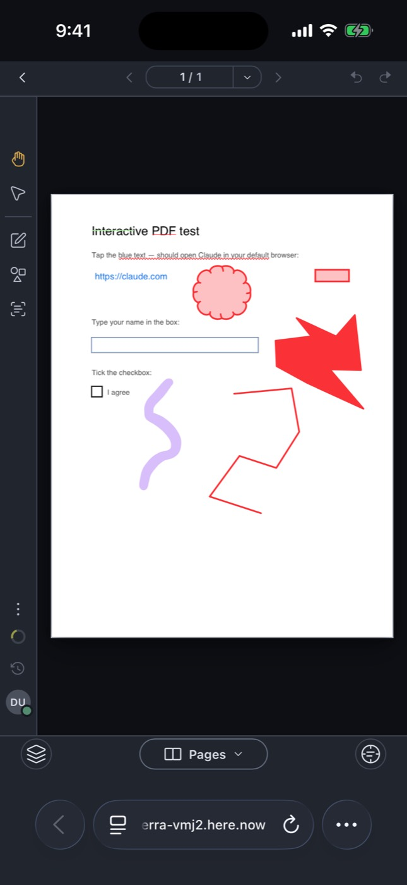

# iOS simulator run 37519796869-1

- Run: https://github.com/IsaiahCalvo/Survey/actions/runs/37519796869
- PR: #809
- Commit: 002477cbcd45366a8ac32c3ccfef5f2f4669cdc1
- Device: iPhone 16 / iOS 26.5 (asked for iPhone 16 / iOS latest)
- Maestro: 2.11.0
- Finished: 2026-10-06 19:44 UTC
- Step outcomes: boot=success devserver=skipped maestro_install=success ready=success expo_install=success baseline=success flows=cancelled expo=skipped
- Timings (s from start): start 0, boot-requested 13, booted 334, baseline 476, end 612
- Video: video compression failed (ffmpeg), raw 35 MB in the artifact

## Flows

### smoke: exit did not run

Skipped optional steps: none

```

Waiting for flows to complete...
```

## Screenshots

### base-01-safari-home.jpg



### base-02-safari-document.jpg



## Step log

```
Xcode 26.6
Build version 17F113
Booting iPhone 16 on iOS 26.5 (B21B1C86-815D-4D59-91A6-5269C8BA06AB)
maestro 2.11.0
booted
Expo Go 57.0.9 installed
shot base-01-safari-home
shot base-02-safari-document
== flow smoke
```
