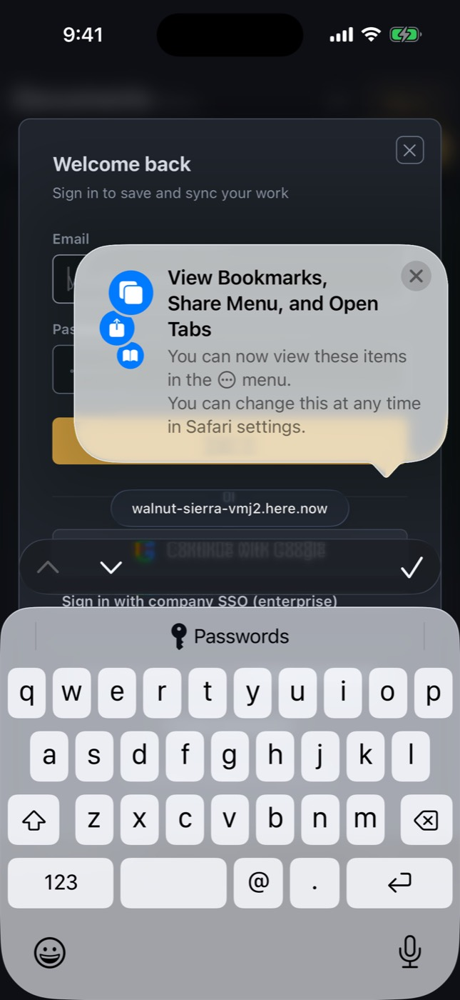
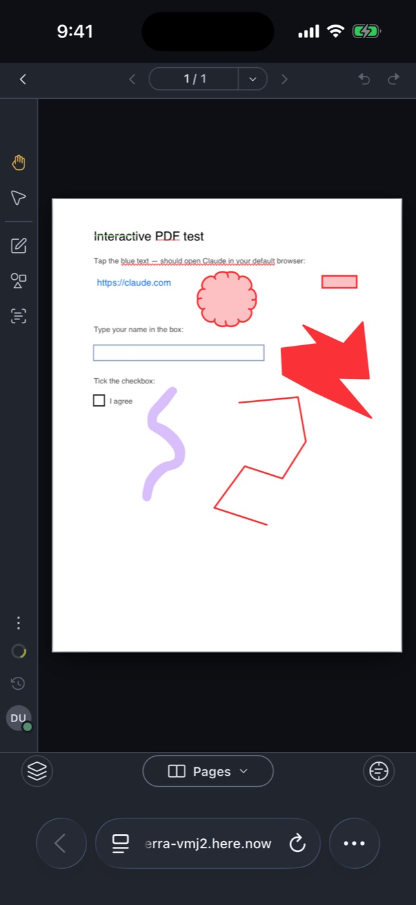
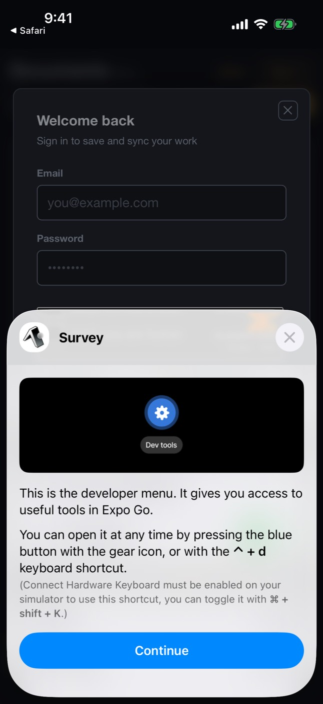
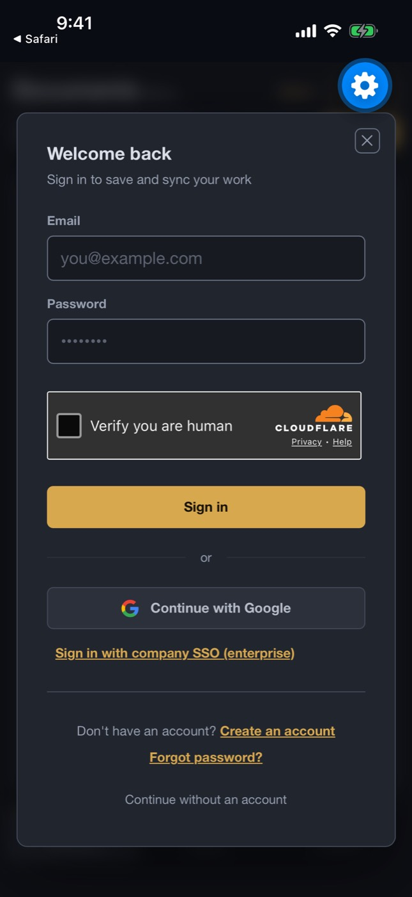
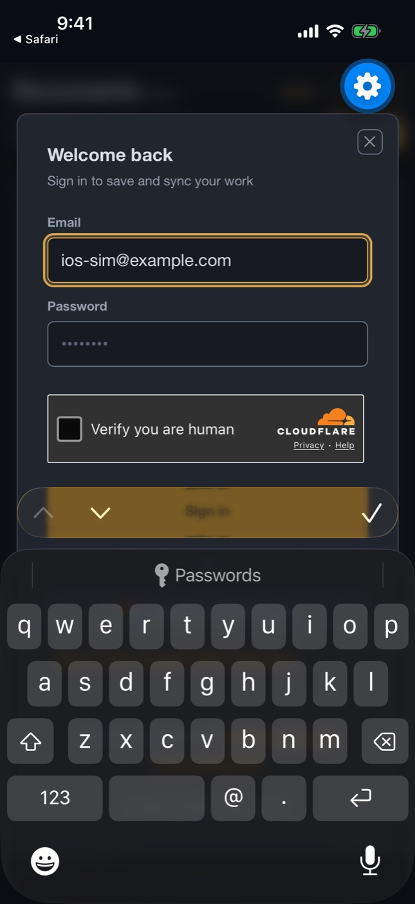
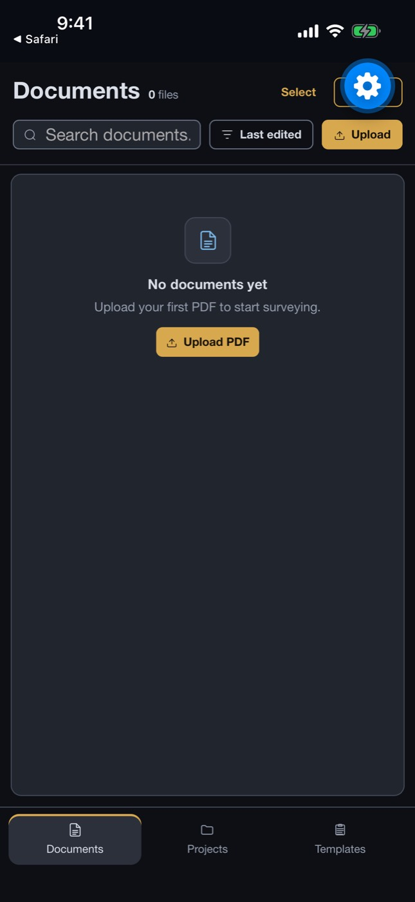
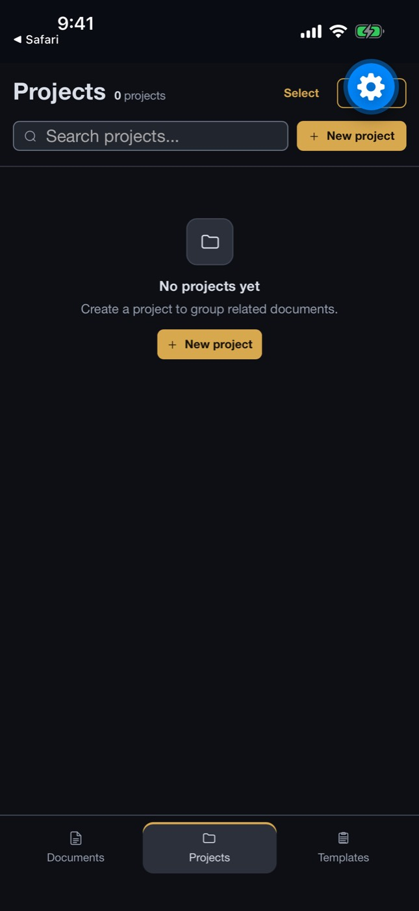

# iOS simulator run 37522390998-1

- Run: https://github.com/IsaiahCalvo/Survey/actions/runs/37522390998
- PR: #809
- Commit: 34d901c5be68be77665179953f02bd007086fbaa
- Device: iPhone 16 / iOS 26.5 (asked for iPhone 16 / iOS latest)
- Maestro: 2.11.0
- Finished: 2026-10-06 20:12 UTC
- Step outcomes: boot=success devserver=skipped maestro_install=success ready=success expo_install=success baseline=success flows=failure expo=success
- Timings (s from start): start 0, boot-requested 14, booted 242, baseline 407, expo 940, end 940
- Video: [video.mp4](video.mp4) (0 MB via ffmpeg, raw 128 MB)

## Flows

### expo-go: exit 0

Skipped optional steps: none

```

Waiting for flows to complete...
[Passed] expo-go (3m 52s)

1/1 Flow Passed in 3m 52s

```

### smoke: exit did not run

Skipped optional steps: none

```

iOS driver not ready in time, consider increasing timeout by configuring MAESTRO_DRIVER_STARTUP_TIMEOUT env variable

The stack trace was:
xcuitest.installer.LocalXCTestInstaller$IOSDriverTimeoutException: iOS driver not ready in time, consider increasing timeout by configuring MAESTRO_DRIVER_STARTUP_TIMEOUT env variable
	at xcuitest.installer.LocalXCTestInstaller.start$lambda$3(LocalXCTestInstaller.kt:134)
	at maestro.utils.Metrics.measured(Metrics.kt:48)
	at xcuitest.installer.LocalXCTestInstaller.start(LocalXCTestInstaller.kt:104)
	at xcuitest.XCTestDriverClient.restartXCTestRunner(XCTestDriverClient.kt:60)
	at ios.xctest.XCTestIOSDevice.open(XCTestIOSDevice.kt:26)
	at ios.LocalIOSDevice.open(LocalIOSDevice.kt:27)
	at maestro.drivers.IOSDriver.open$lambda$3(IOSDriver.kt:94)
	at maestro.utils.Metrics.measured(Metrics.kt:48)
	at maestro.utils.Metrics.measured$default(Metrics.kt:42)
	at maestro.drivers.IOSDriver.open(IOSDriver.kt:93)
	at maestro.Maestro$Companion.ios(Maestro.kt:802)
	at maestro.cli.session.MaestroSessionManager.createIOS(MaestroSessionManager.kt:446)
	at maestro.cli.session.MaestroSessionManager.createMaestro(MaestroSessionManager.kt:218)
	at maestro.cli.session.MaestroSessionManager.newSession(MaestroSessionManager.kt:106)
	at maestro.cli.session.MaestroSessionManager.newSession$default(MaestroSessionManager.kt:64)
	at maestro.cli.command.TestCommand.runShardSuite(TestCommand.kt:477)
	at maestro.cli.command.TestCommand.access$runShardSuite(TestCommand.kt:81)
	at maestro.cli.command.TestCommand$handleSessions$1$results$1$1.invokeSuspend(TestCommand.kt:438)
	at kotlin.coroutines.jvm.internal.BaseContinuationImpl.resumeWith(ContinuationImpl.kt:34)
	at kotlinx.coroutines.DispatchedTask.run(DispatchedTask.kt:100)
	at kotlinx.coroutines.internal.LimitedDispatcher$Worker.run(LimitedDispatcher.kt:124)
	at kotlinx.coroutines.scheduling.TaskImpl.run(Tasks.kt:89)
	at kotlinx.coroutines.scheduling.CoroutineScheduler.runSafely(CoroutineScheduler.kt:586)
	at kotlinx.coroutines.scheduling.CoroutineScheduler$Worker.executeTask(CoroutineScheduler.kt:820)
	at kotlinx.coroutines.scheduling.CoroutineScheduler$Worker.runWorker(CoroutineScheduler.kt:717)
	at kotlinx.coroutines.scheduling.CoroutineScheduler$Worker.run(CoroutineScheduler.kt:704)

```

## Screenshots

### base-01-safari-home.jpg



### base-02-safari-document.jpg



### base-03-expo-go-end.jpg


### expo-01-first-screen.jpg



### expo-02-survey-home.jpg


### expo-03-keyboard.jpg



### expo-04-keyboard-typed.jpg



### expo-05-home-guest.jpg



### expo-06-projects-tab.jpg



### expo-07-after-scroll.jpg


### expo-08-landscape.jpg


### expo-09-portrait-again.jpg


## Step log

```
Xcode 26.6
Build version 17F113
Booting iPhone 16 on iOS 26.5 (7D27EE17-C5C8-4D9F-867C-3A58F5247D1C)
maestro 2.11.0
booted
Expo Go 57.0.9 installed
shot base-01-safari-home
openurl try 1 exit 0
shot base-02-safari-document
== flow smoke
== flow expo-go
flow expo-go exit 0
```
