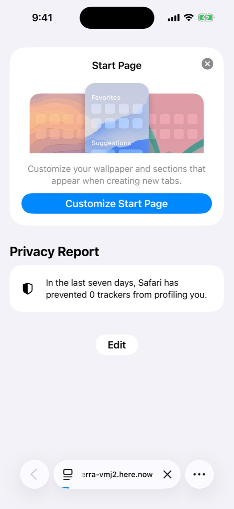
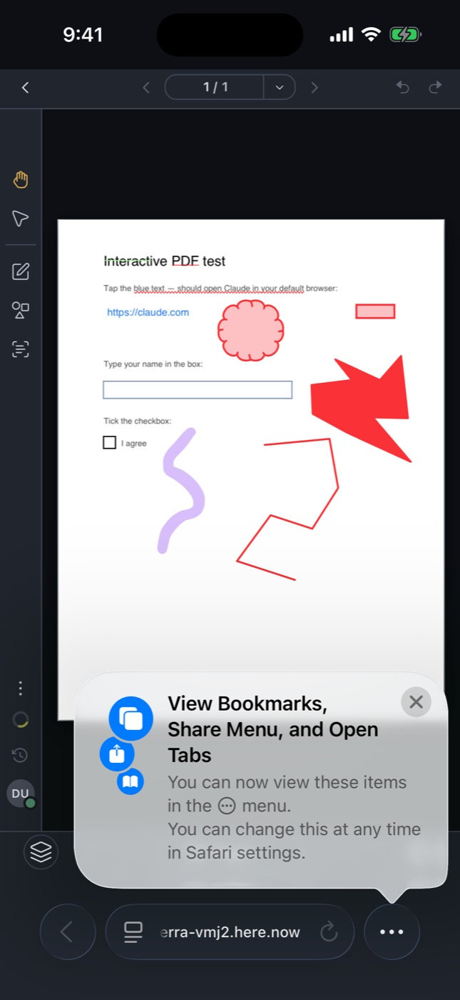

# iOS simulator run 37525078585-1

- Run: https://github.com/IsaiahCalvo/Survey/actions/runs/37525078585
- PR: #809
- Commit: c462fa8fb91bfdfeea306ce50e6e90a0dbf68fb2
- Device: iPhone 16 / iOS 26.5 (asked for iPhone 16 / iOS latest)
- Maestro: 2.11.0
- Finished: 2026-10-06 20:28 UTC
- Step outcomes: boot=success devserver=skipped maestro_install=success ready=success expo_install=success baseline=success flows=cancelled expo=skipped
- Timings (s from start): start 0, boot-requested 18, booted 253, baseline 441, end 628
- Video: [video.mp4](video.mp4) (665 KB via ffmpeg, raw 111 MB)

## Flows

### smoke: exit did not run

Skipped optional steps: none

```
```

## Screenshots

### base-01-safari-home.jpg



### base-02-safari-document.jpg



## Step log

```
Xcode 26.6
Build version 17F113
Booting iPhone 16 on iOS 26.5 (A70B7671-A976-4EA6-92D2-C0AEAC38381F)
maestro 2.11.0
booted
Expo Go 57.0.9 installed
shot base-01-safari-home
shot base-02-safari-document
== flow smoke
```
