# iOS simulator run 37526391151-1

- Run: https://github.com/IsaiahCalvo/Survey/actions/runs/37526391151
- PR: #809
- Commit: bbe46bf9d703fce8b57bc66093ce31a0ceead545
- Device: iPhone 16 / iOS 26.5 (asked for iPhone 16 / iOS latest)
- Maestro: 2.11.0
- Finished: 2026-10-06 20:47 UTC
- Step outcomes: boot=success devserver=skipped maestro_install=success ready=success expo_install=success baseline=success flows=success expo=success
- Timings (s from start): start 0, boot-requested 18, booted 258, baseline 412, flows 778, expo 976, end 976
- Video: [video.mp4](video.mp4) (1282 KB via ffmpeg, raw 122 MB)

## Flows

### expo-go: exit 0

Skipped optional steps: none

```

Waiting for flows to complete...
WARNING: GL pipe is running in software mode (Renderer ID=0x1020400)
[Passed] expo-go (2m 29s)

1/1 Flow Passed in 2m 29s

```

### smoke: exit 0

Skipped optional steps: Element not found: Text matching regex: Continue; Element not found: Text matching regex: Done

```

Waiting for flows to complete...
WARNING: GL pipe is running in software mode (Renderer ID=0x1020400)
[Passed] smoke (3m 11s)

1/1 Flow Passed in 3m 11s

```

## Screenshots

### base-01-safari-home.jpg

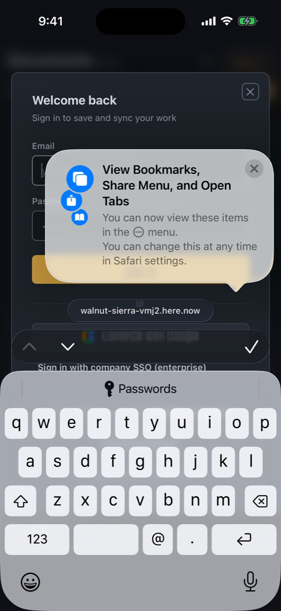

### base-02-safari-document.jpg


### base-03-expo-go-end.jpg

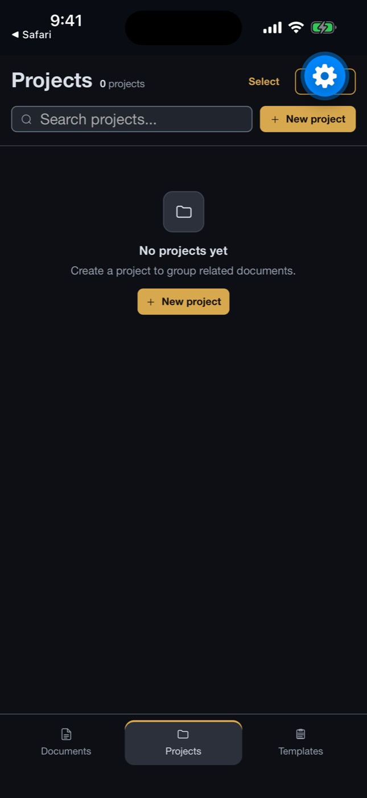

### expo-01-first-screen.jpg


### expo-02-survey-home.jpg


### expo-03-keyboard.jpg

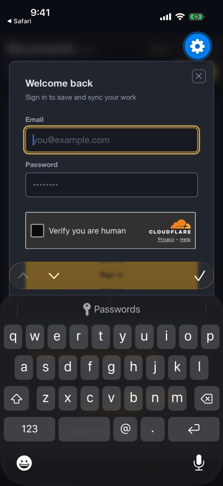

### expo-04-keyboard-typed.jpg

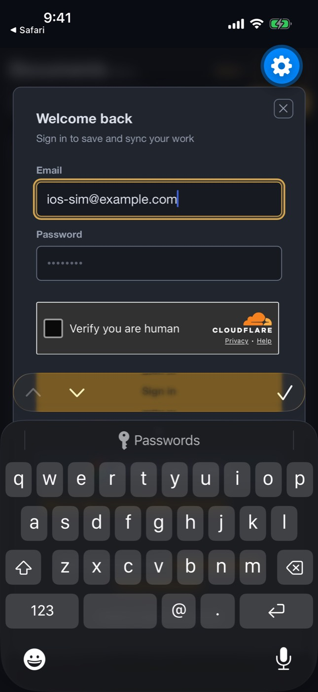

### expo-05-home-guest.jpg


### expo-06-projects-tab.jpg


### expo-07-after-scroll.jpg


### expo-08-landscape.jpg


### expo-09-portrait-again.jpg


### smoke-01-home.jpg


### smoke-02-keyboard.jpg

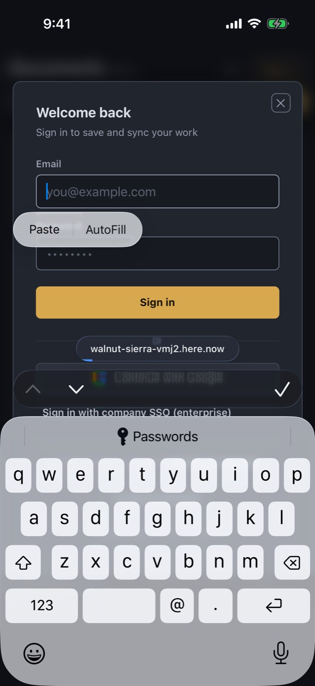

### smoke-03-keyboard-typed.jpg


### smoke-04-home-guest.jpg

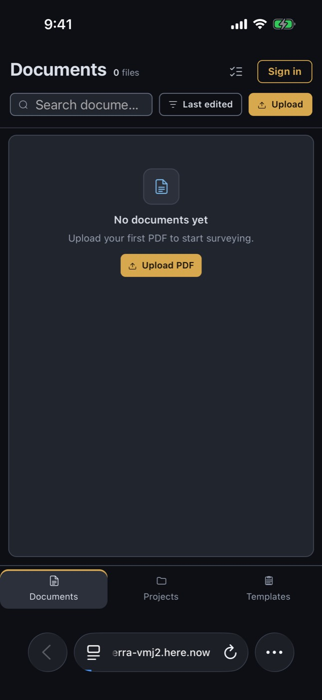

### smoke-05-templates-tab.jpg

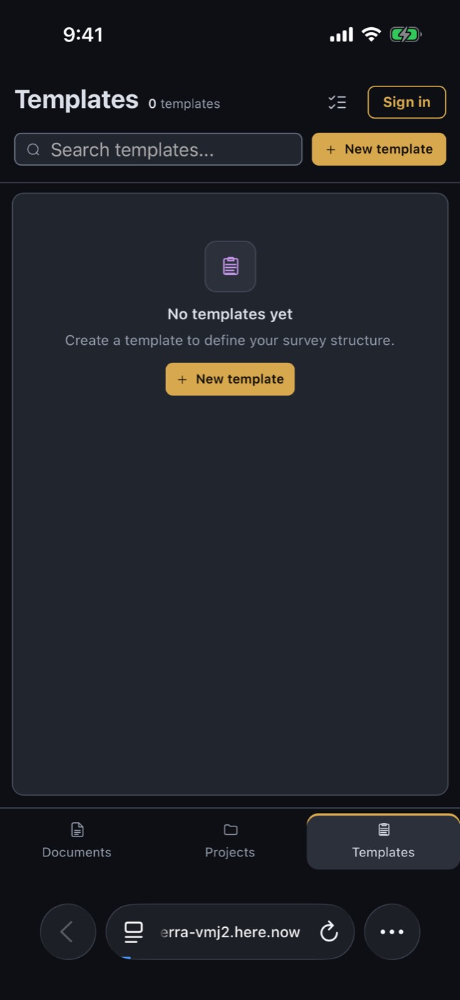

### smoke-06-document.jpg

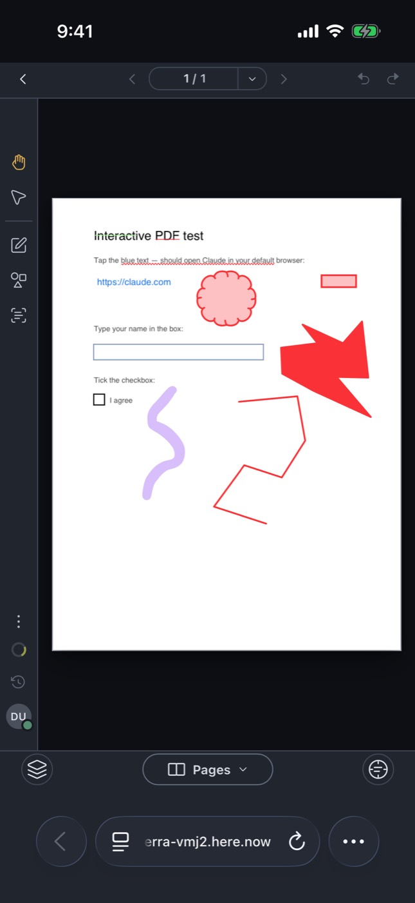

### smoke-07-draw-tool.jpg


### smoke-08-pages-sheet.jpg


### smoke-09-form-field-keyboard.jpg

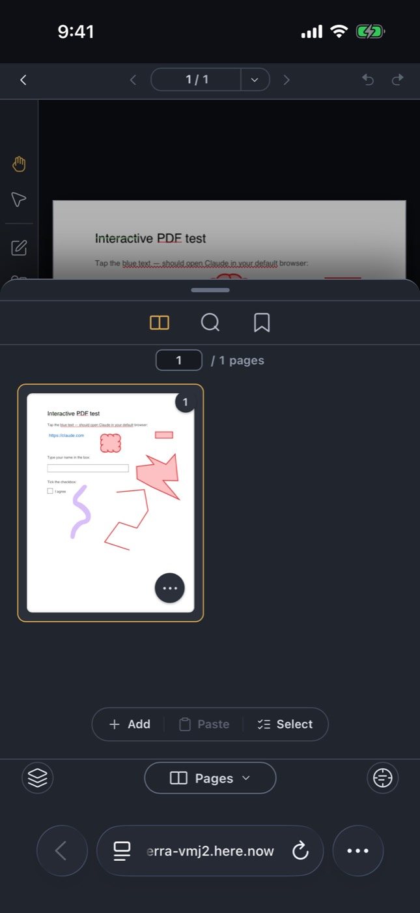

### smoke-09b-form-field-typed.jpg


### smoke-10-after-scroll.jpg


### smoke-11-landscape.jpg

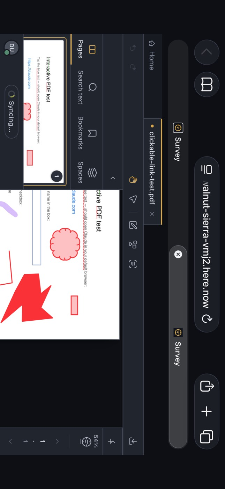

### smoke-12-portrait-again.jpg

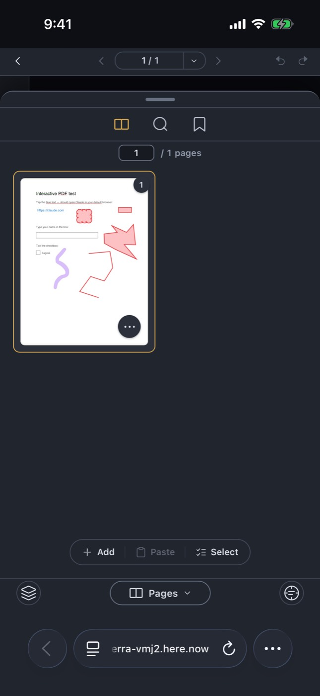

### smoke-step-011-tapOnElement-Continue.jpg

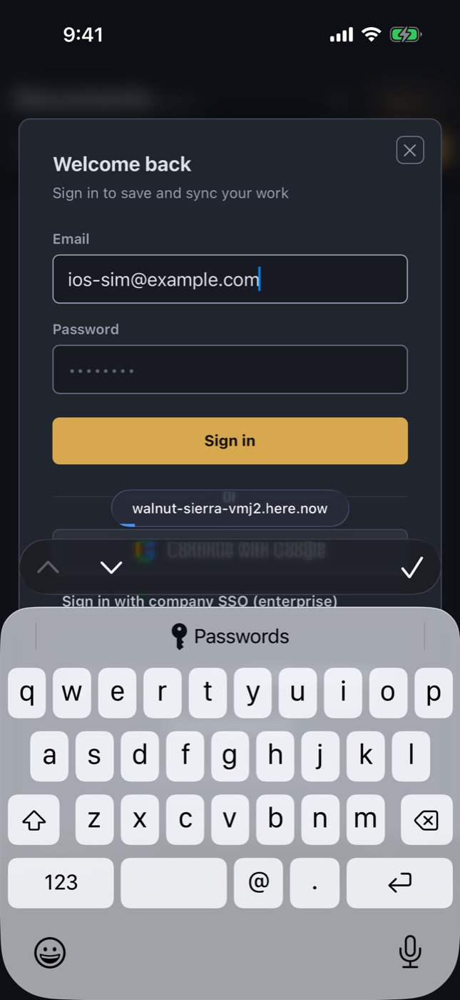

### smoke-step-038-tapOnElement-Done.jpg


## Step log

```
Xcode 26.6
Build version 17F113
Booting iPhone 16 on iOS 26.5 (3813D1C3-4ADA-44BE-A63A-5A1FFBE56A11)
maestro 2.11.0
booted
Expo Go 57.0.9 installed
shot base-01-safari-home
shot base-02-safari-document
== flow smoke
flow smoke exit 0
== flow expo-go
flow expo-go exit 0
```
