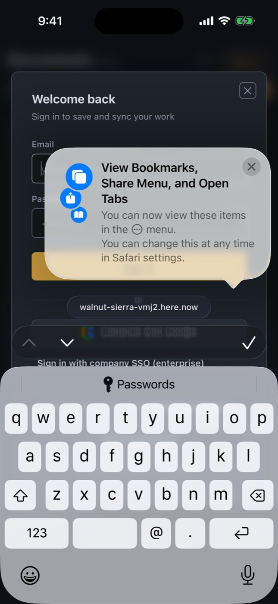
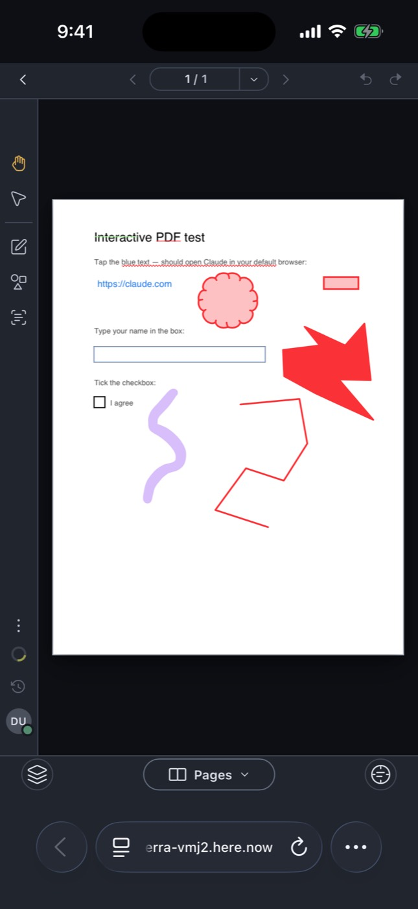

# iOS simulator run 37529661670-1

- Run: https://github.com/IsaiahCalvo/Survey/actions/runs/37529661670
- PR: #809
- Commit: bd87ba0cd3ed40179a9e728bbb96ac12b579c35d
- Device: iPhone 16 / iOS 26.5 (asked for iPhone 16 / iOS latest)
- Maestro: 2.11.0
- Finished: 2026-10-06 21:14 UTC
- Step outcomes: boot=success devserver=skipped maestro_install=success ready=success expo_install=success baseline=success flows=failure expo=failure
- Timings (s from start): start 0, boot-requested 11, booted 232, baseline 389, end 990
- Video: [video.mp4](video.mp4) (1360 KB via ffmpeg, raw 125 MB)

## Flows

### expo-go: exit did not run

Skipped optional steps: none

```

Waiting for flows to complete...
[Failed] expo-go (1m 20s)

1/1 Flow Failed

```

### smoke: exit did not run

Skipped optional steps: none

```

Waiting for flows to complete...
[Failed] smoke (2m 24s)

1/1 Flow Failed

```

## Screenshots

### base-01-safari-home.jpg



### base-02-safari-document.jpg



### expo-01-first-screen.jpg


### expo-go-step-008-tapOnElement-Continue.jpg


## Step log

```
Xcode 26.6
Build version 17F113
Booting iPhone 16 on iOS 26.5 (975D1C2F-6206-4CD1-BB84-B31EEB2CB4E7)
maestro 2.11.0
booted
Expo Go 57.0.9 installed
shot base-01-safari-home
shot base-02-safari-document
== flow smoke
== flow expo-go
```
