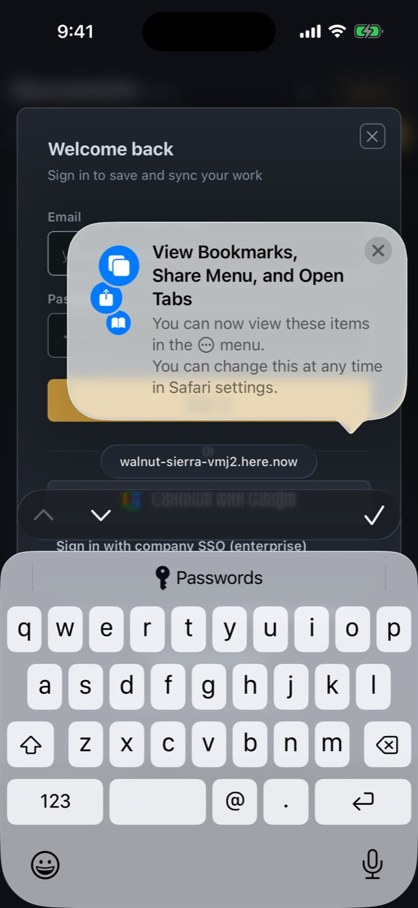

# iOS simulator run 37532688153-1

- Run: https://github.com/IsaiahCalvo/Survey/actions/runs/37532688153
- PR: #809
- Commit: 5e6c029097df982316af80138fc15bfc86a7ef17
- Device: iPhone 16 / iOS 26.5 (asked for iPhone 16 / iOS latest)
- Maestro: 2.11.0
- Finished: 2026-10-06 21:22 UTC
- Step outcomes: boot=success devserver=skipped maestro_install=success ready=success expo_install=success baseline=cancelled flows=skipped expo=skipped
- Timings (s from start): start 0, boot-requested 10, booted 234, end 312
- Video: [video.mp4](video.mp4) (132 KB via ffmpeg, raw 8 MB)

## Flows

## Screenshots

### base-01-safari-home.jpg



## Step log

```
Xcode 26.6
Build version 17F113
Booting iPhone 16 on iOS 26.5 (06AAD1FF-8E31-42F1-B550-F7430F86B1F4)
maestro 2.11.0
booted
Expo Go 57.0.9 installed
shot base-01-safari-home
```
