# iOS simulator run 37535055895-1

- Run: https://github.com/IsaiahCalvo/Survey/actions/runs/37535055895
- PR: #809
- Commit: 0df5c1c31cdecfc27649d331253a3c317306299e
- Device: iPhone 16 / iOS 26.5 (asked for iPhone 16 / iOS latest)
- Maestro: 2.11.0
- Finished: 2026-10-06 22:07 UTC
- Step outcomes: boot=success devserver=skipped maestro_install=success ready=success expo_install=success baseline=success flows=success expo=success
- Timings (s from start): start 0, boot-requested 141, booted 406, baseline 534, flows 939, expo 1318, end 1318
- Video: [video.mp4](video.mp4) (1719 KB via ffmpeg, raw 187 MB)

## Flows

### expo-go: exit 0

Skipped optional steps: Assertion is false: "Welcome back|Documents|Sign in|Continue" is visible; Element not found: Text matching regex: Continue; Element not found: Text matching regex: Close; Assertion is false: "Welcome back|Documents" is visible; Element not found: Text matching regex: you@example.com; Element not found: Text matching regex: Welcome back; Element not found: Text matching regex: Continue without an account; Element not found: Text matching regex: Projects

```

Waiting for flows to complete...
WARNING: GL pipe is running in software mode (Renderer ID=0x1020400)
[Passed] expo-go (5m 6s)

1/1 Flow Passed in 5m 6s

```

### smoke: exit 0

Skipped optional steps: Element not found: Text matching regex: Continue

```

Waiting for flows to complete...
WARNING: GL pipe is running in software mode (Renderer ID=0x1020400)
[Passed] smoke (4m 30s)

1/1 Flow Passed in 4m 30s

```

## Screenshots

### base-01-safari-home.jpg

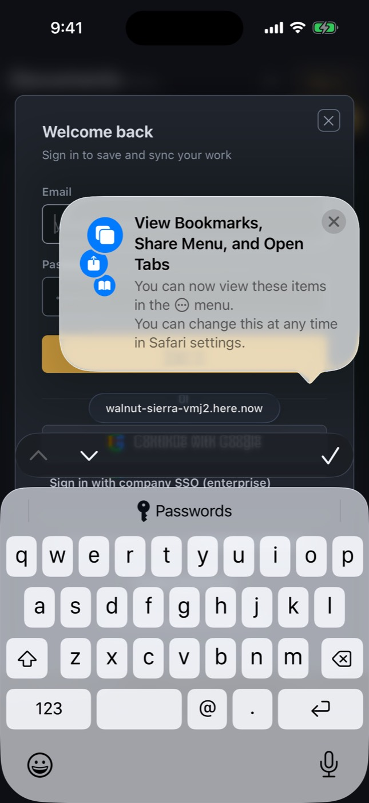

### base-02-safari-document.jpg


### base-03-expo-go-end.jpg

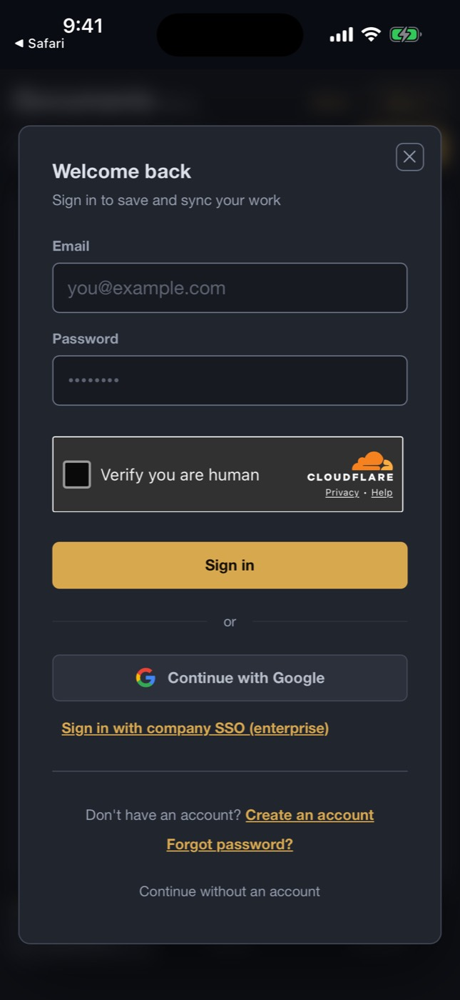

### expo-01-first-screen.jpg


### expo-02-survey-home.jpg

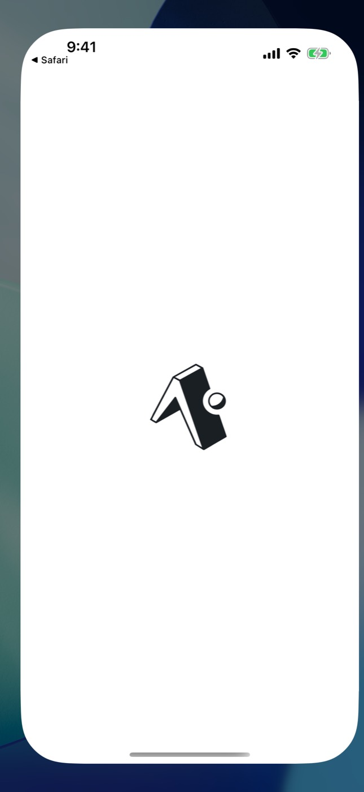

### expo-03-keyboard.jpg

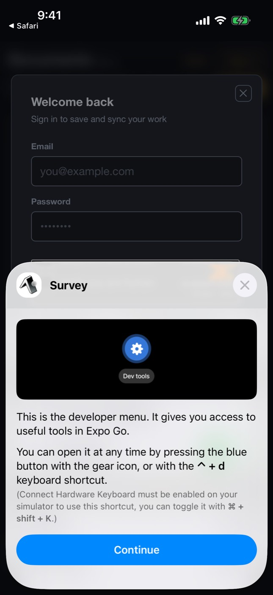

### expo-04-keyboard-typed.jpg


### expo-05-home-guest.jpg


### expo-06-projects-tab.jpg


### expo-07-after-scroll.jpg

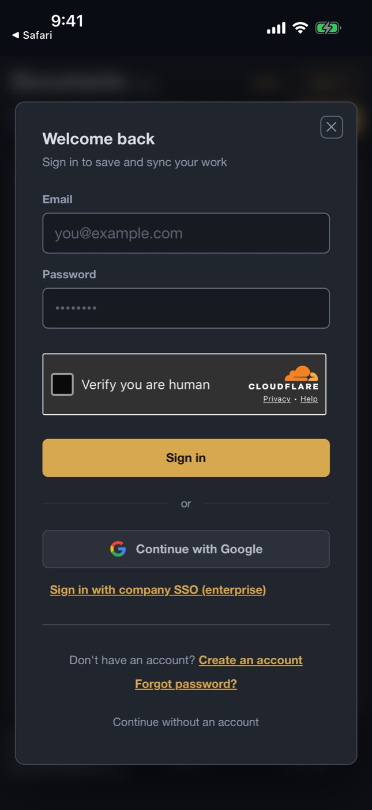

### expo-08-landscape.jpg


### expo-09-portrait-again.jpg


### expo-go-step-006-assertCondition-Welcome_backDocumentsSig.jpg


### expo-go-step-008-tapOnElement-Continue.jpg


### expo-go-step-009-tapOnElement-Close.jpg

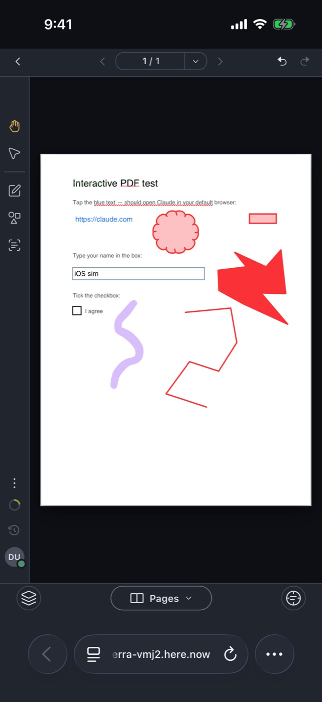

### expo-go-step-010-assertCondition-Welcome_backDocuments.jpg


### expo-go-step-013-tapOnElement-you_example.com.jpg


### expo-go-step-018-tapOnElement-Welcome_back.jpg


### expo-go-step-019-tapOnElement-Continue_without_an_account.jpg


### expo-go-step-022-tapOnElement-Projects.jpg


### smoke-01-home.jpg


### smoke-02-keyboard.jpg

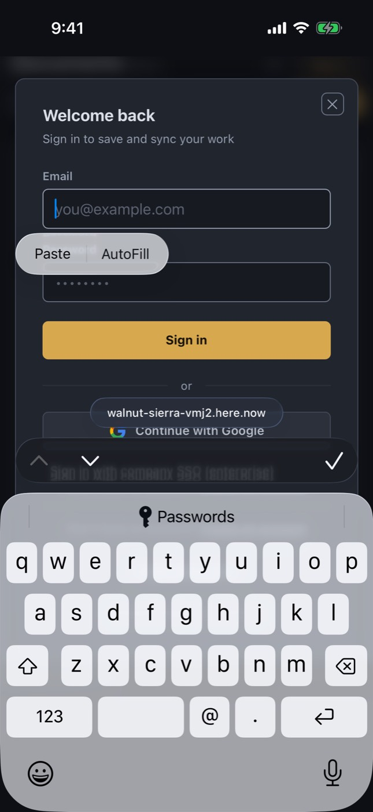

### smoke-03-keyboard-typed.jpg

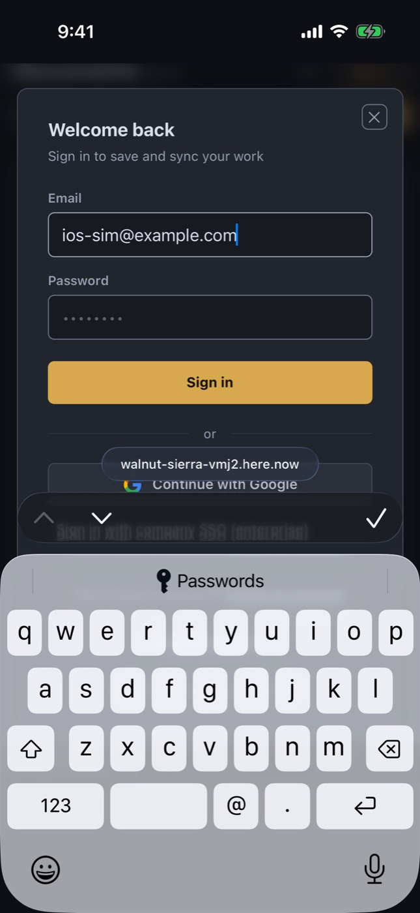

### smoke-04-home-guest.jpg

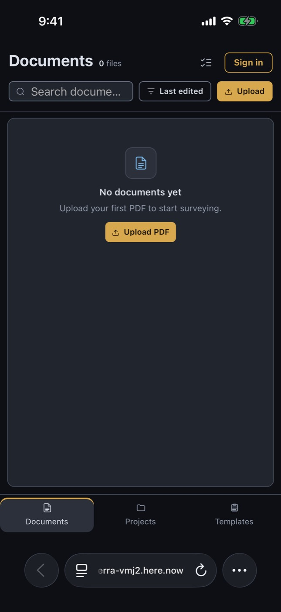

### smoke-05-templates-tab.jpg

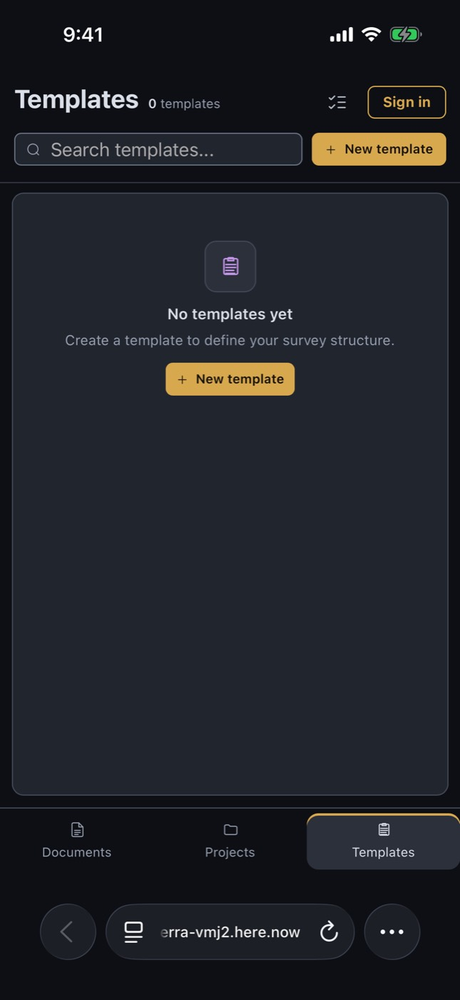

### smoke-06-document.jpg


### smoke-07-draw-tool.jpg


### smoke-08-pages-sheet.jpg


### smoke-09-form-field-keyboard.jpg

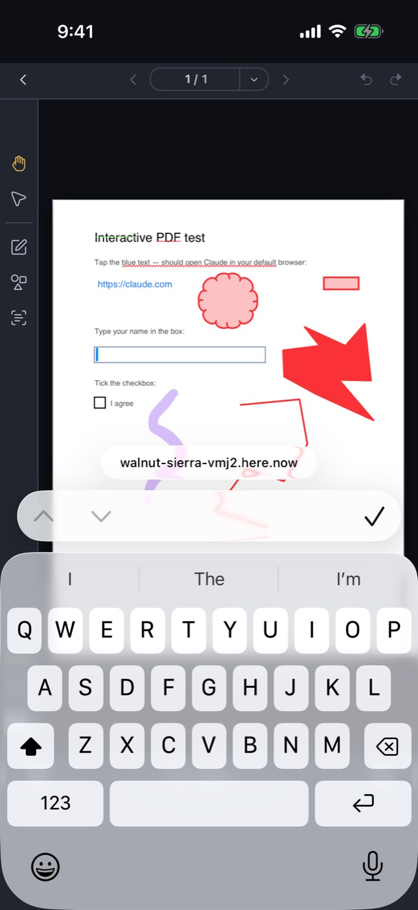

### smoke-09b-form-field-typed.jpg


### smoke-10-after-scroll.jpg


### smoke-11-landscape.jpg

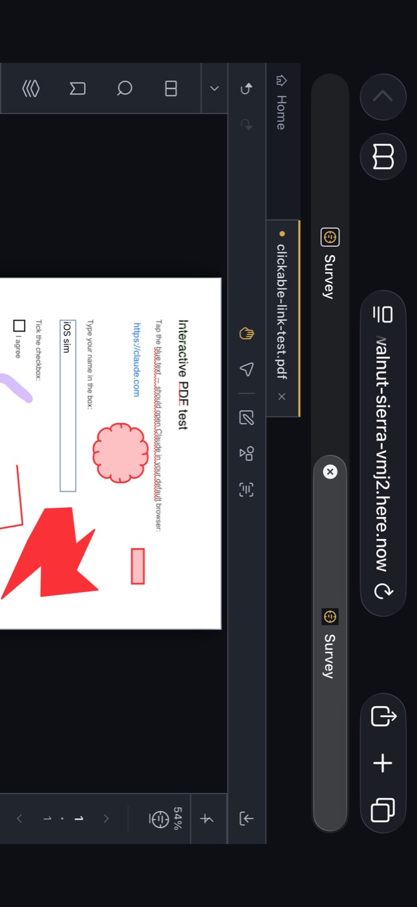

### smoke-12-portrait-again.jpg


### smoke-step-011-tapOnElement-Continue.jpg


## Step log

```
Xcode 26.6
Build version 17F113
Booting iPhone 16 on iOS 26.5 (6AE2C142-5830-4855-90BC-4744A1231F06)
maestro 2.11.0
booted
Expo Go 57.0.9 installed
shot base-01-safari-home
shot base-02-safari-document
== flow smoke
flow smoke exit 0
== flow expo-go
flow expo-go exit 0
```
